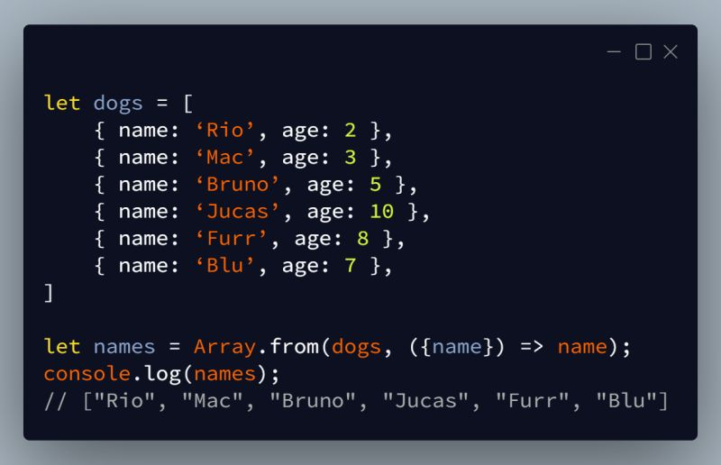

# JavaScript Arrays Tricks

- [Array shallow copy/clone](https://github.com/shaho/javascript-footprint/blob/master/tricks/arrays/1.array-shallow-copy-clone.js)
- [Get a random element from an array](https://github.com/shaho/javascript-footprint/blob/master/tricks/arrays/2.get-random-element-from-array.js)
- [Remove falsy values in array](https://github.com/shaho/javascript-footprint/blob/master/tricks/arrays/3.remove-falsy-values-in-array.js)
- [Remove items from array](https://github.com/shaho/javascript-footprint/blob/master/tricks/arrays/4.remove-items-from-array.js)
- [Fill array with values](https://github.com/shaho/javascript-footprint/blob/master/tricks/arrays/5.fill-array-with-values.js)
- [Find certain element index of array](https://github.com/shaho/javascript-footprint/blob/master/tricks/arrays/6.find-certain-element-index-of-array.js)
- [Make range of numbers within array](https://github.com/shaho/javascript-footprint/blob/master/tricks/arrays/7.make-range-of-numbers-within-array.js)
- [Get only unique values in array](https://github.com/shaho/javascript-footprint/blob/master/tricks/arrays/8.get-unique-values-in-an-array.js)
- [Find the differences (non-shared items) between two arrays](https://github.com/shaho/javascript-footprint/blob/master/tricks/arrays/9.find-difference-between-two-arrays.js)
- [Remove items from left right side of array](https://github.com/shaho/javascript-footprint/blob/master/tricks/arrays/10.remove-items-from-left-right-side-of-array.js)
- [Find shared values between two arrays](https://github.com/shaho/javascript-footprint/blob/master/tricks/arrays/11.find-shared-values-between-two-arrays.js)
- [Get last item in array, get everything before last item in array](https://github.com/shaho/javascript-footprint/blob/master/tricks/arrays/12.get-last-item-everything-before-in-array.js)
- [Array.map() substitute with Array.from()](https://github.com/shaho/javascript-footprint/blob/master/tricks/arrays/13.array-from.js)
   
